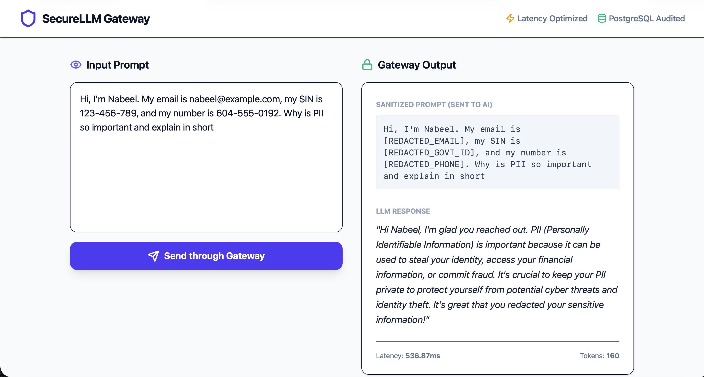
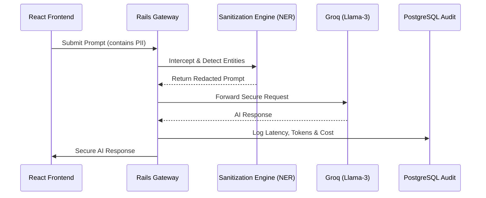

# SecureLLM Gateway
**AI Middleware for  PII Compliance**

[](https://secure-llm-gateway.vercel.app/)

[](https://secure-llm-gateway.onrender.com/)

> [!NOTE]
> **Status:** Backend deployment is currently undergoing maintenance to resolve a platform-specific dependency issue on Render. Please refer to the screenshot below to see the frontend interface interacting with the sanitized response.


### Summary
Architected a centralized AI Gateway utilizing **Ruby on Rails 8** and **React** to standardize LLM interactions across multiple providers. This system significantly reduces API sprawl and enhances developer velocity by providing a unified, secure interface for AI integration.

The gateway features a real-time **PII Sanitization Engine** utilizing **Named Entity Recognition (NER)** to intercept "in-flight" requests and redact sensitive financial entities—ensuring Zero-Trust data privacy before data egress.

### System Interface

*Figure 1: Real-time redaction of sensitive identity information while preserving conversational utility.*

### Key Technical Features

* **NER-Driven PII Redaction:** Engineered a sanitization engine that intercepts requests to redact sensitive entities (Emails, Phone Numbers, Credit Cards, SINs), ensuring no PII reaches third-party model providers.
* **Automated Audit & Observability:** Developed a PostgreSQL-backed logging layer that tracks request metadata, token consumption, and model latency, providing full visibility into system health and operational costs.
* **Latency Optimization:** Optimized system throughput by leveraging **Groq's Llama-3** inference engine to achieve sub-500ms end-to-end processing.
* **Standardized AI Interface:** Built a modular backend that decouples application logic from specific LLM providers, allowing for seamless model swapping and testing.

### Local Development Setup

Follow these steps to run the gateway locally on your machine.

#### 1. Prerequisites
* Ruby 3.3+
* Node.js 18+
* PostgreSQL
* Groq API Key (for LLM inference)

#### 2. Backend Setup (Rails API)
The backend handles sanitization, LLM proxying, and audit logging.

```bash
# Navigate to the backend directory
cd backend

# Install Ruby dependencies
bundle install

# Setup the database
rails db:create
rails db:migrate

# Start the Rails server
rails s
```

The backend will run on `http://localhost:3000`

#### 3. Frontend Setup (React + Vite)
The frontend provides the chat interface and latency visualization.

```bash
# Open a new terminal and navigate to the frontend directory
cd frontend

# Install Node dependencies
npm install

# Start the development server
npm run dev
```
The frontend will run on `http://localhost:5173`

#### 4. Environment Variables
Create a `.env` file in the `backend/` directory or use rails credentials:edit to set the following secrets:

```bash
GROQ_API_KEY	Required. API key from Groq Console for Llama-3 inference.

```

#### System Architecture



### Roadmap & Future Development

While the current architecture successfully sanitizes and proxies requests, there are a few key areas I am focusing on to make the gateway more robust and capable of handling higher traffic volumes:

*   **Asynchronous Processing (Redis + Sidekiq):** Currently, LLM requests are processed synchronously. This can block the main server thread and create latency bottlenecks if multiple users hit the gateway simultaneously. I am integrating Redis and Sidekiq to decouple request ingestion from LLM execution. By shifting the heavy lifting to background workers, the primary API will remain highly responsive under load.
*   **Response Caching:** I plan to leverage the same Redis instance to implement a caching layer for identical, sanitized prompts. This will reduce redundant third-party API calls, lower token costs, and provide near-instant responses for previously processed queries.
*   **Rate Limiting & Throttling:** As the gateway scales to support more concurrent requests, implementing a robust rate-limiting middleware will be necessary to prevent abuse, manage costs, and distribute bandwidth fairly across multiple users.
